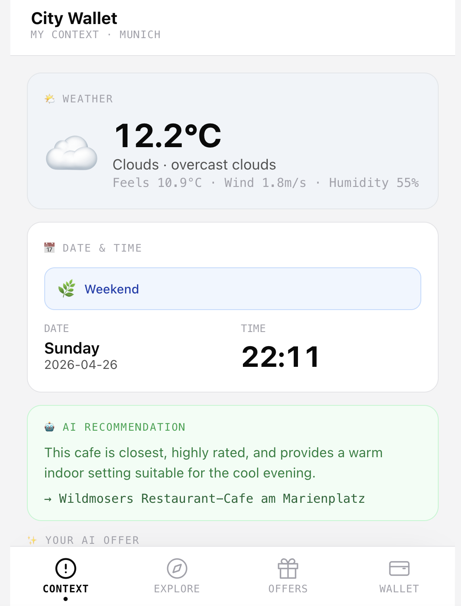
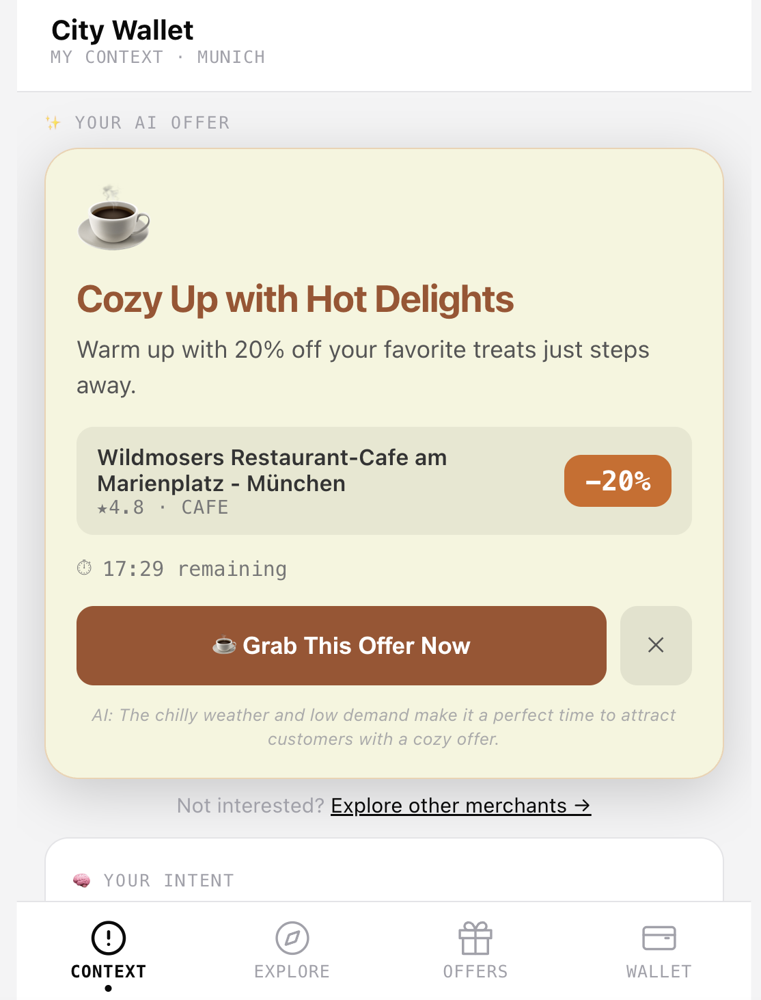
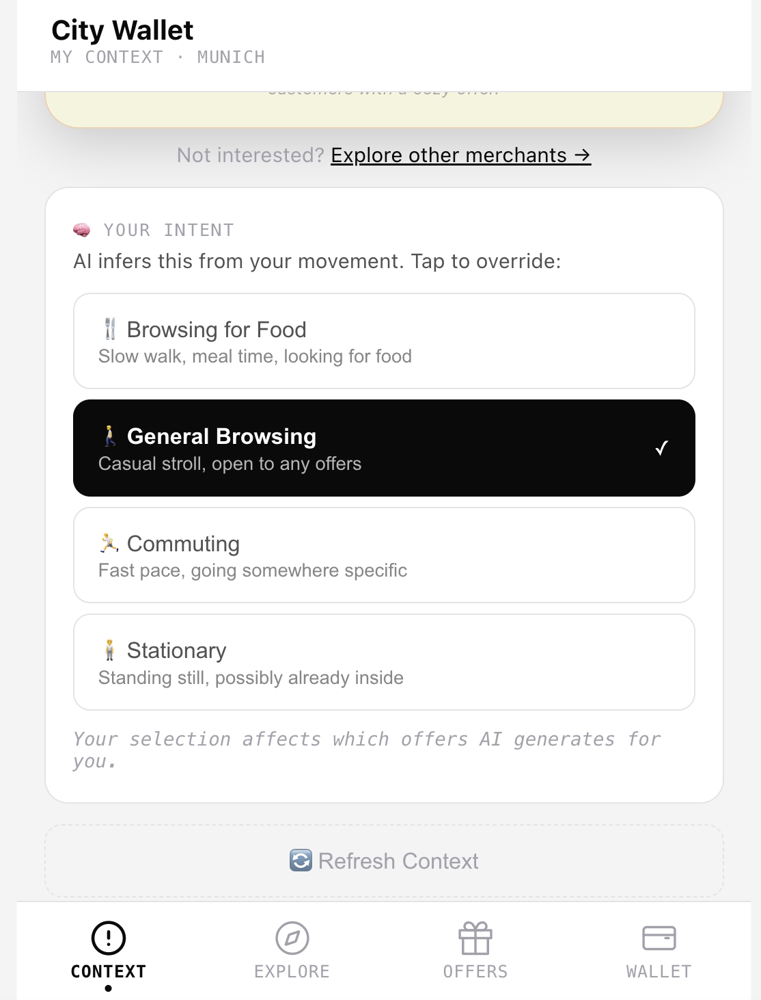
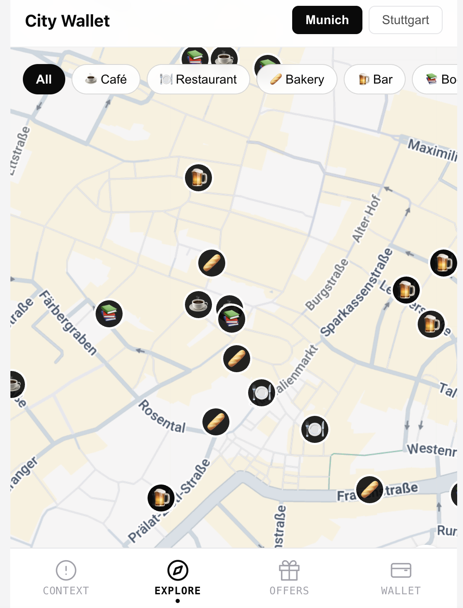
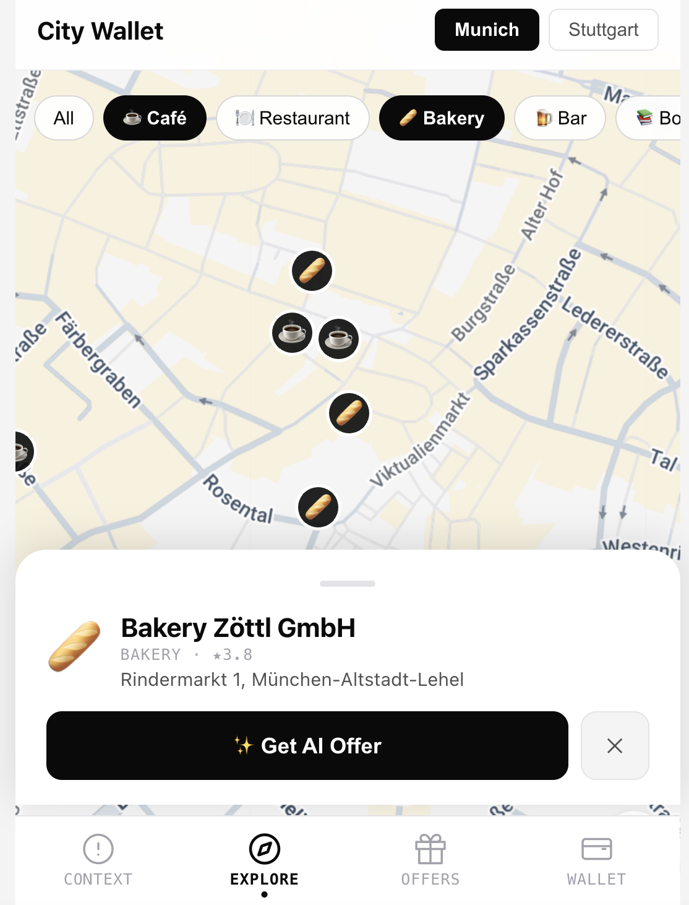
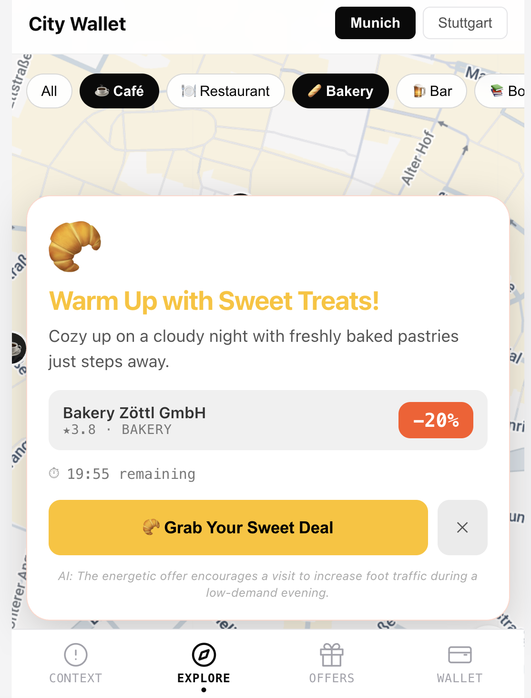
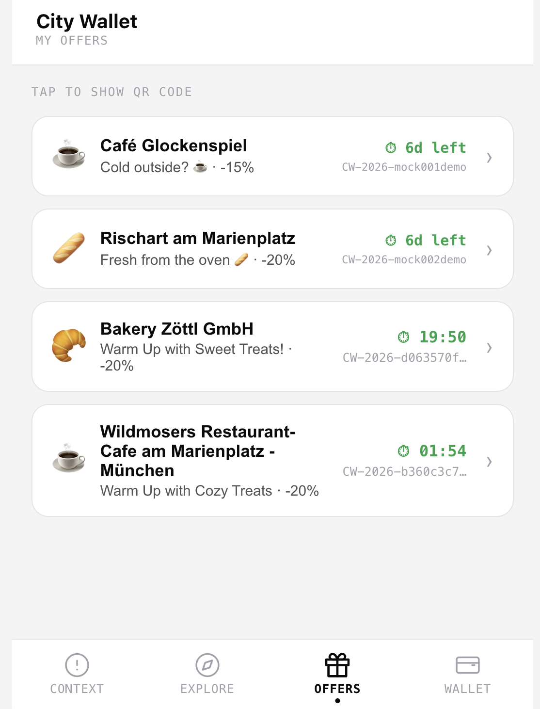
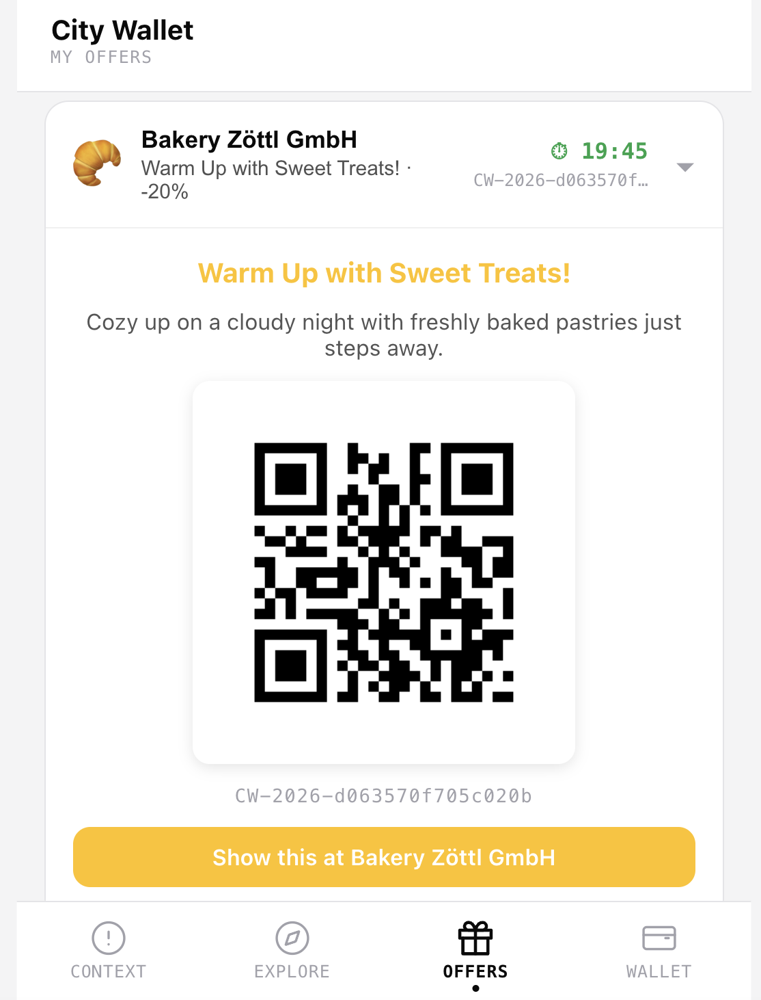
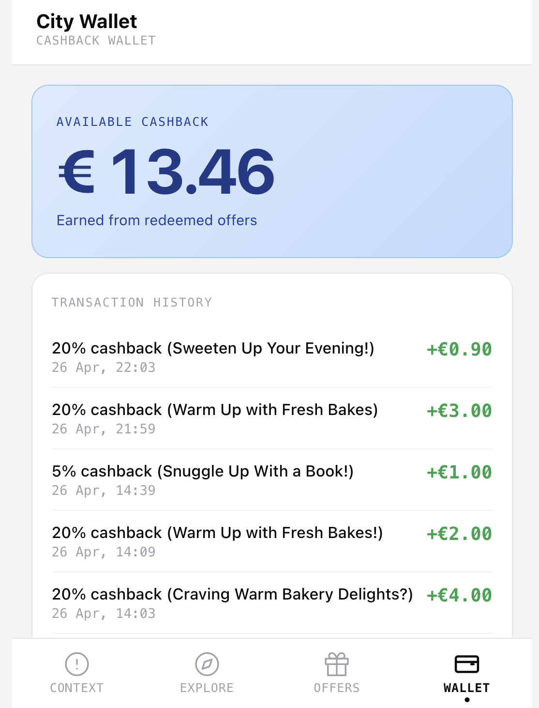

# 🛍️ City Wallet — Consumer Demo

## Meet Mia

Mia is 28, works in marketing, and is walking through Munich's Altstadt on a Tuesday lunch break. She has 12 minutes to spare. She's slightly cold. A café 80 meters away has been quiet all morning.

No system connects these two facts. Until now.

---

## Step 1 — The App Reads Mia's World

Mia opens City Wallet. The app immediately begins reading her environment: live weather from OpenWeatherMap, the current time slot, and nearby merchant activity. She doesn't have to do anything.

---

The context panel shows the full signal breakdown — 19°C, scattered clouds, Sunday afternoon, 12 partner stores within 200m. All data is live. All data is real.

---

On-device analysis classifies Mia's movement as **browsing** — slow walking speed, two stops in the last 10 minutes, high direction variance. This analysis happens entirely on Mia's phone. No raw GPS coordinates ever leave the device. Only the abstract result — `"browsing_food"` — is sent to the server. **Privacy by design.**

---

## Step 2 — Mia Explores Nearby Merchants

The Explore tab shows real merchants within 500m, pulled from Google Places and ranked by a composite score combining distance, rating, and live transaction demand. The quieter a merchant is right now, the higher it appears.

---

Mia taps a café. She sees the real name, category, rating, address, and current transaction density. The system has already identified this café as very quiet right now — only 3 transactions versus a 12-transaction average. A high demand gap. A strong candidate for an offer.

---

## Step 3 — AI Generates a Personalised Offer

The system triggers offer generation. **GPT-4o** receives the full context — cold weather, lunch break, browsing user, quiet café — along with the merchant's rules. In under 500ms, it returns a complete offer created from scratch: headline, subtext, discount, colors, icon, and CTA. Every word and every visual is generated for this exact moment.

> **Dynamic Pricing:** The discount is not fixed. The AI determines the percentage based on live demand. Right now the café is very quiet, so the AI selects a higher discount to drive footfall. During peak hours it would choose a lower one. The merchant only sets a maximum cap — the AI optimises within that range in real time.

---

## Step 4 — Mia Claims Her Offer

Mia accepts the offer. It appears immediately in her **My Offers** list. The card shows the merchant name, the AI-generated headline, the discount percentage, and a live countdown timer. Demo offers are also shown here for reference.

---

Mia taps the card and a **QR code** appears — a unique redemption token valid for the countdown duration. She walks 80 meters to the café and shows this screen at the counter. Once the merchant scans it, the offer is redeemed and the card disappears from her list automatically.

---

## Step 5 — Cashback Lands in Her Wallet

After redemption, the cashback is credited instantly to Mia's **City Wallet**. The wallet page shows her running balance and full transaction history. Every offer redeemed, every euro saved — in one place.

---

## What Just Happened

| Step | What City Wallet did |
|------|---------------------|
| Sensed context | Live weather + time slot + on-device intent — no raw GPS transmitted |
| Discovered merchants | Real Google Places data, ranked by live demand gap |
| Generated the offer | GPT-4o created a unique offer in under 500ms |
| Applied dynamic pricing | Discount optimised to current merchant demand, within merchant-set cap |
| Redeemed | Unique QR token validated, cashback credited instantly |

The offer Mia received didn't exist 5 minutes ago. It was created for her, at this moment, because this moment was exactly right.
