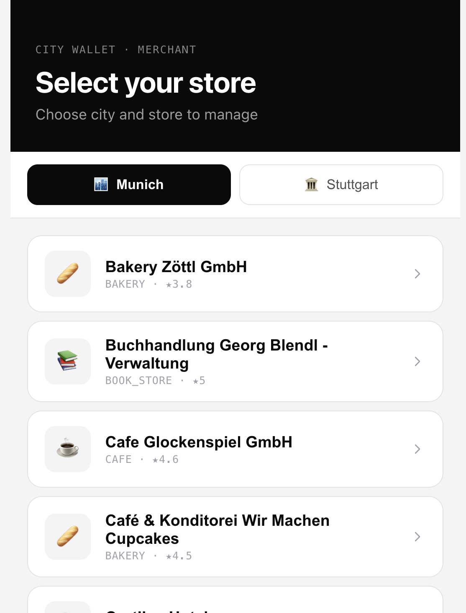
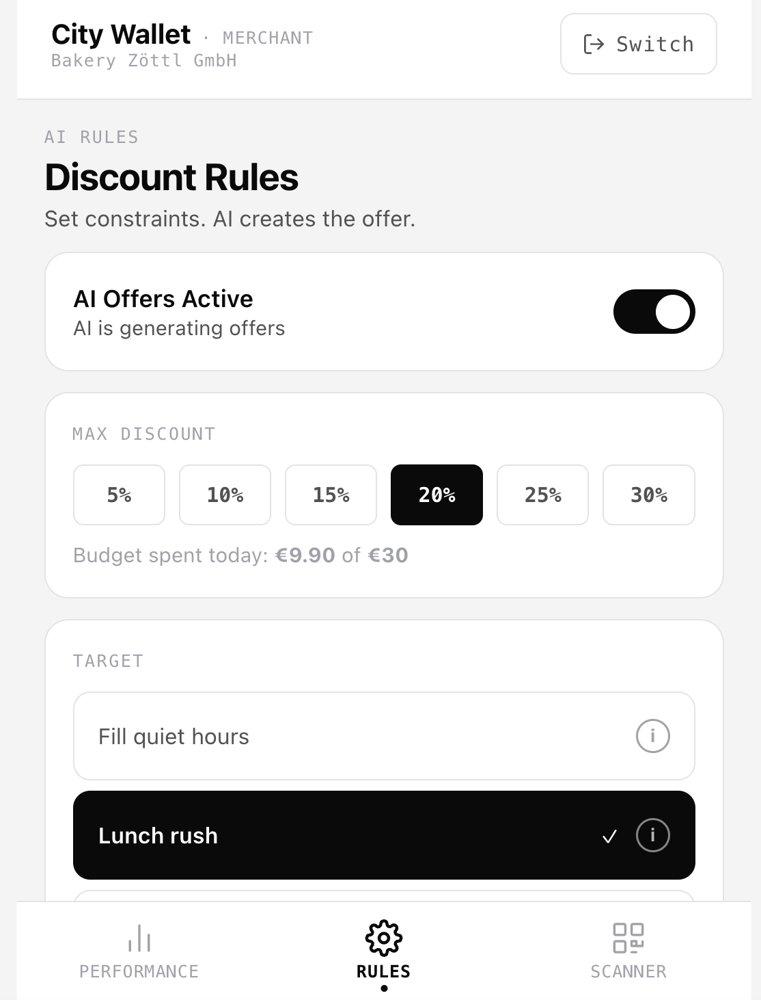
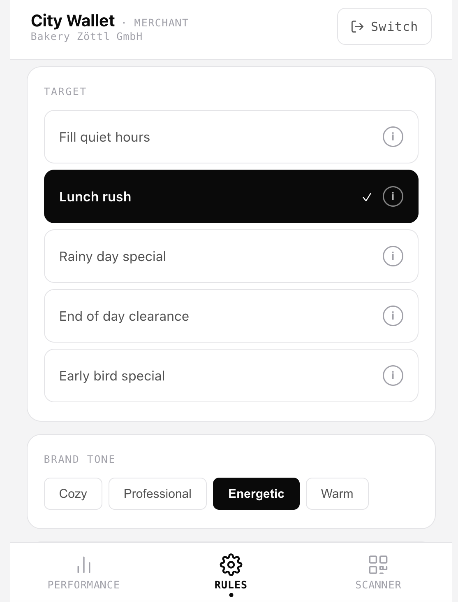
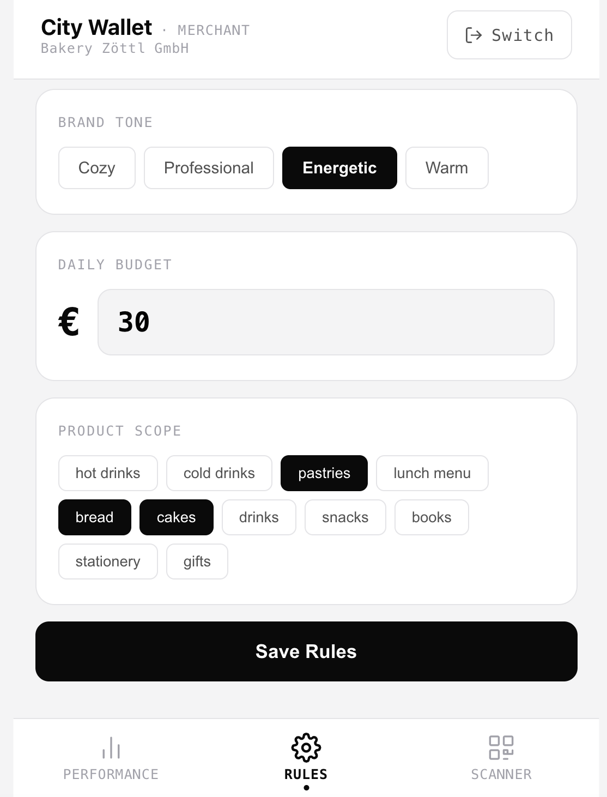
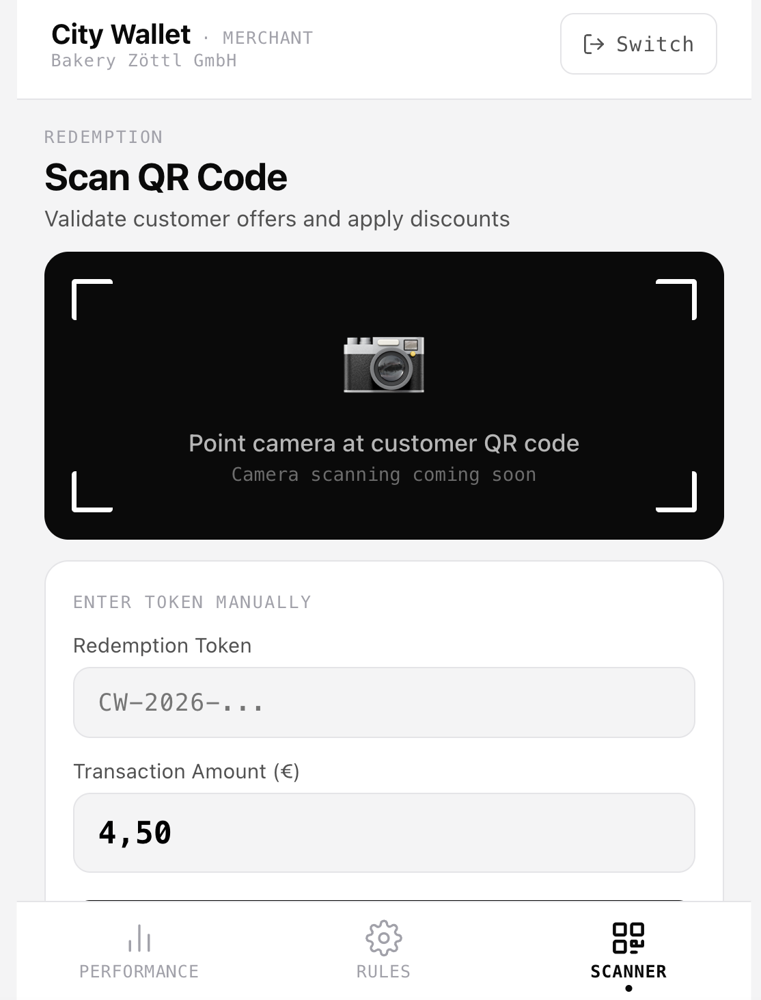
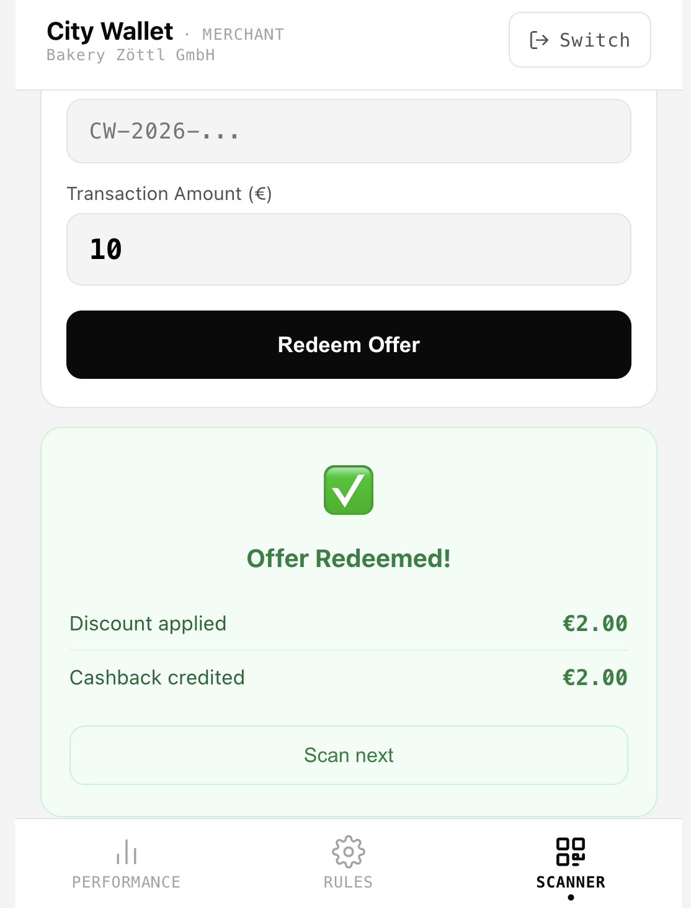
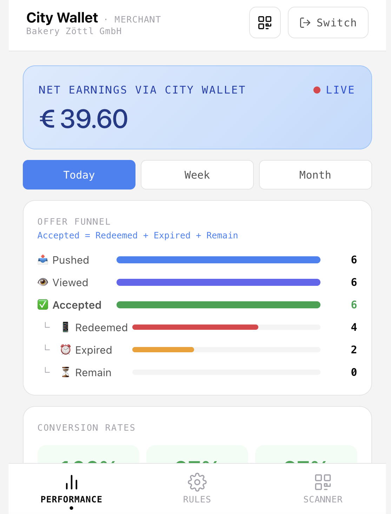
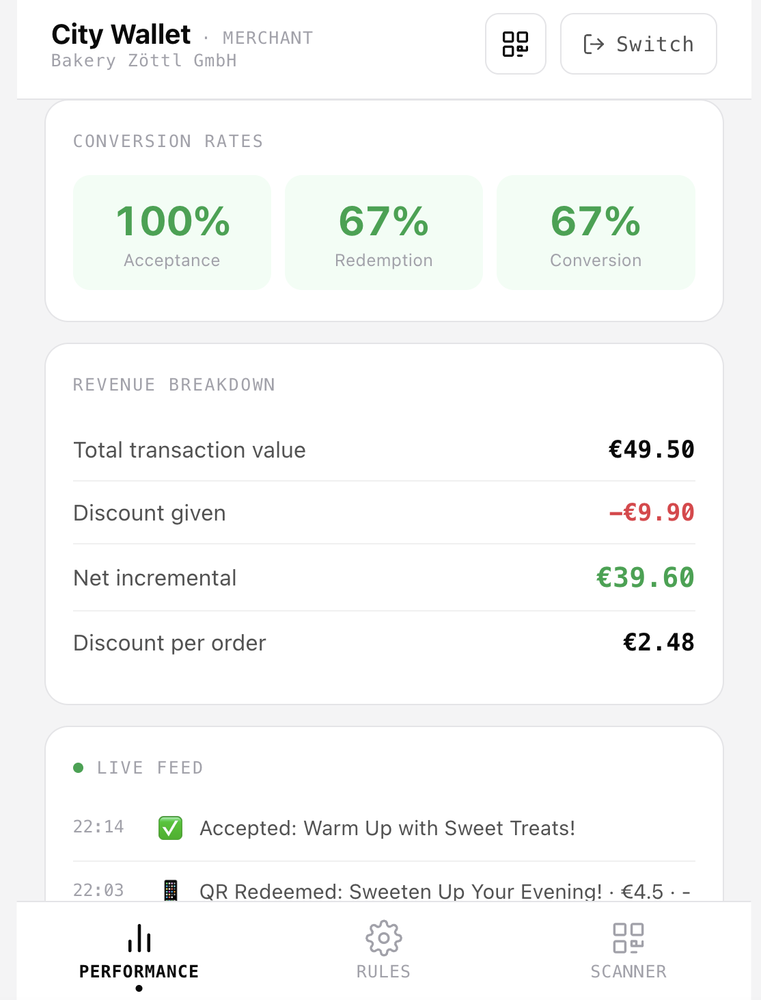

# 🏪 City Wallet — Merchant Demo

## Meet Thomas

Thomas runs **Bakery Zöttl** in Munich's Altstadt. Every Tuesday morning he watches the same thing happen: the lunch rush hasn't arrived yet, the display cases are full, and his counter staff are standing idle.

He's tried flyers. He's tried social media. Nothing reaches the right person at the right moment.

Today, he set up City Wallet. Here's what his Tuesday looks like now.

---

## Step 1 — Thomas Selects His Store

Thomas opens the City Wallet merchant app and selects Bakery Zöttl from the list. The stores are populated from real Google Places data — he doesn't need to register manually. His store is recognised instantly. Once selected, it's saved for future sessions.

---

## Step 2 — Thomas Configures His AI Rules

Thomas opens the Rules tab. This is the **only thing he ever has to set up**. He chooses his target goal: *Fill quiet hours*. He sets his maximum discount: **15%**. He doesn't write any copy. He doesn't design anything. He just sets the limits.

---

He selects his product scope — pastries and hot drinks — and his brand tone: *cozy*. He sets a daily budget cap of €30. The AI will never exceed either limit. Every offer it generates will stay within these rules, automatically.

---

Thomas sets his active hours and enables the system. From this point on, City Wallet monitors demand in real time and generates offers autonomously whenever conditions are right. Thomas can pause or update his rules at any time — changes take effect immediately.

---

## Step 3 — A Customer Arrives With a QR Code

It's 12:17. Mia walks in and shows her phone. She has an offer: *"Fresh from the oven 🥖 — 15% off your pastry."*

Thomas opens the Scanner tab and enters the redemption token from the customer's screen. He enters the transaction amount and confirms.

---

The backend validates the token instantly. The screen confirms:
- **Discount applied:** the amount Thomas gives up
- **Cashback credited:** the amount returned to the customer's wallet

Thomas sees only what he needs. No personal data. No wallet balance. No identifying information. The QR token is now invalidated — it cannot be used again.

---

## Step 4 — Thomas Checks His Performance

At the end of lunch, Thomas opens the Performance tab. He sees the complete offer funnel for today: how many offers were pushed, how many were viewed, how many accepted, how many redeemed. Below the funnel, conversion rates are shown at a glance — acceptance rate, redemption rate, overall conversion.

---

The revenue breakdown shows everything Thomas cares about: total transaction value generated through City Wallet, discount given, net incremental revenue, and cost per acquisition. The live event feed at the bottom shows every moment — offer generated, accepted, redeemed — in real time with timestamps.

This Tuesday, Bakery Zöttl had its quietest hours filled. Thomas spent €3.38 in discounts. He generated €19.12 in net incremental revenue. Three customers came in who would otherwise have walked past.

---

## What Thomas Did

| Action | Time spent |
|--------|-----------|
| Select store | 10 seconds |
| Configure AI rules | 2 minutes |
| Scan QR code | 20 seconds |
| Review performance | Optional |

**Total setup time: under 3 minutes. Ongoing effort: zero.**

The AI handled everything else — sensing the moment, generating the offer, deciding the discount, reaching the right customer at the right second.

Thomas didn't run a campaign. He just set the rules and let City Wallet do the rest.
